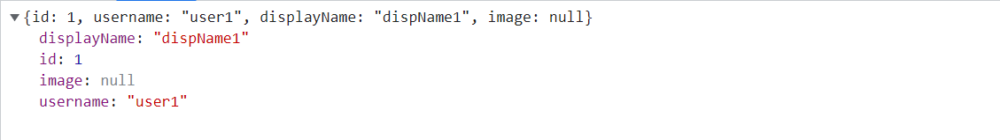

# Hoaxify App
Hoaxify is a social media app that allows users to share hoaxes. It is a full-stack application that uses Spring Boot for the backend and React for the frontend. It is a project that I created while learning Spring Boot and React.

## Features
- User registration
- User login
- User profile
- User List with pagination
- User profile image upload
- Hoax submission
- Hoax List with load more

## Technologies
- Spring Boot
- Spring Security
- Spring Data JPA
- Spring Validation
- Tika-Core
- Spring Boot DevTools
- Lombok
- H2 Database

## Screenshots

### SignUp 

<strong>POST - /api/v1/users</strong> User registration not-null validation

 <strong>POST - /api/v1/users</strong> User registration  validation

<strong>POST - /api/v1/users</strong>  User registration  Success

### Login 

<strong>POST - /api/v1/auth</strong> User login authentication

<strong>POST - /api/v1/auth</strong> User login authentication success

### User 

<strong>GET - /api/v1/users</strong> User List with pagination

<strong>GET - /api/v1/user</strong> User profile 

<strong>GET - /api/v1/user</strong> User profile not found

<strong>PUT - /api/v1/user/userid</strong> User update failure

<strong>PUT - /api/v1/user/userid</strong> User update success

### Hoax

<strong>GET - /api/v1/hoaxes</strong> Hoax List with pagination

<strong>POST - /api/v1/hoaxes</strong> Hoax submission failure

<strong>POST - /api/v1/hoaxes</strong> Hoax submission success

